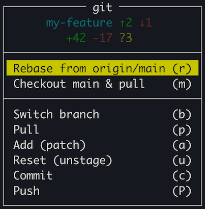

# tmux-git-menu

A quick-actions git menu for tmux, bound to a single key. Opens a popup with the most common git operations: rebase from origin's default branch, checkout the default branch & pull, switch branch (via fzf), pull, push, stage interactively, unstage, commit.

The menu header shows the current branch, ahead/behind counts vs. upstream, and changed/untracked line counts.



## Requirements

- `tmux` 3.2+ (for `display-popup` and `display-menu`)
- `git`
- `fzf` (for the Switch branch action)

## Installation

### TPM

```tmux
set -g @plugin 'justincampbell/tmux-git-menu'
```

Then prefix + I to fetch and source.

### Local

Symlink the checked-out repo into `~/.tmux/plugins/`:

```sh
ln -s ~/Code/justincampbell/tmux-git-menu ~/.tmux/plugins/tmux-git-menu
```

Then add to `.tmux.conf`:

```tmux
set -g @plugin 'tmux-git-menu'
```

## Configuration

| Option | Default | Description |
| --- | --- | --- |
| `@tmux-git-menu-key` | `g` | Key (after prefix) that opens the menu |

Example:

```tmux
set -g @tmux-git-menu-key G
```

## Actions

| Key | Action |
| --- | --- |
| `r` | Rebase onto `origin/<default>` (fetches first) |
| `m` | Checkout default branch and pull |
| `b` | Switch branch (fzf, sorted by recency) |
| `p` | Pull |
| `a` | `git add -p` (interactive staging) |
| `u` | `git reset` (unstage everything) |
| `c` | Commit (prompts for message) |
| `P` | Push |

`q` or `Esc` closes the menu.
